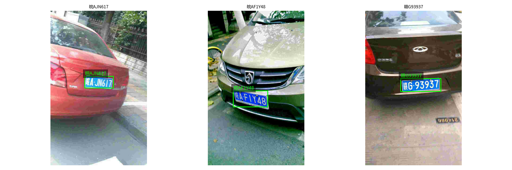

# Car-plate-detection-and-recognition

Project "Car Plate Recognition and Reconstruction with Deep Learning" for the 2024/2025 Computer Vision course.

This repository aims to reimplement the [PDLPR paper](https://www.mdpi.com/1424-8220/24/9/2791) and compare its performance with a CRNN model using CTC loss.

For the detection part, we used a pre-trained YOLOv5 model and fine-tuned it on the CCPD2019 dataset ([link to the pre-trained model](https://huggingface.co/keremberke/yolov5n-license-plate)).  
For the recognition part, we trained and tested the models on the CCPD2019 dataset and then fine-tuned them on CCPD2020 and UC3M-LP to verify their adaptability to different domains and license plate styles.




# Datasets
Original datasets are available at the following links:
- [CCPD2019](https://github.com/detectRecog/CCPD?tab=readme-ov-file#ccpd-chinese-city-parking-dataset-eccv): a collection of Chinese vehicle license plates under various real-world conditions.
- [CCPD2020](https://github.com/detectRecog/CCPD?tab=readme-ov-file#update-on-16092020-we-add-a-new-energy-vehicle-sub-dataset-ccpd-green-which-has-an-eight-digit-license-plate-number): a collection of Chinese green license plates for electric vehicles.
- [UC3M-LP](https://github.com/ramajoballester/UC3M-LP): a collection of annotated European (Spanish) license plates.

We created our own customized versions of the above datasets by selecting and reorganizing the folder structure for training and evaluation purposes. In particular:

- For **CCPD2019**, we used a subset consisting of 30,000 images for training, and 10,000 images each for validation and testing, selected uniformly from each subfolder (Detection and recognition).
- For **CCPD2020**, we used the full dataset (Only recognition).
- For **UC3M-LP**, we only considered license plates of type "A", which correspond to the standard Spanish plate format (Only recognition).

You can download the modified datasets here: [Download datasets](https://drive.google.com/drive/folders/1OFoHWQIxt4oGIwG8GiSzMRre96kkHe7N?usp=drive_link)

# Models Weights

The trained models used for evaluation and fine-tuning can be found at the following link: [Download weights](https://drive.google.com/drive/folders/1BfeRaXrH47S8uYvDaDbehxZHeomWBgFl?usp=sharing)

# Project Structure
```
Car-plate-detection-and-recognition/
├── README.md
├── Presentation.pdf
├── Yolov5+crnn_CCPD2019.ipynb
├── Yolov5+pdlpr_CCPD2019.ipynb
├── Detection/
│   ├── Finetune_Yolo.ipynb
│   ├── configs/
│       └── ccpd.yaml 
├── Recognition/
    ├── crnn_CCPD2019.ipynb
    ├── crnn_CCPD2020.ipynb
    ├── crnn_UC3M_LP.ipynb
    ├── PDLPR_CCPD2019.ipynb
    ├── PDLPR_CCPD2020.ipynb
    ├── PDLPR_UC3M_LP.ipynb
```

# How to run
All notebooks in this repository are designed to run on **Google Colab**.
To execute them correctly, follow these steps:
1) Mount your Google Drive at the beginning of each notebook
2) Organize your files on Drive using the following structure:
    - Model weights should be placed under: `"/content/drive/MyDrive/Computer_vision/...."`
    - Datasets should be stored under: `"/content/drive/MyDrive/Dataset_CV/..."`
3) Run all cells sequentially from top to bottom.

# Results

## YOLOv5 Detection Results (IoU > 0.7)
We report both the **Total Accuracy** (correct detections over the full set) and **Detected Accuracy** (correct over detected) for each CCPD2019 subset.

| Subset         | Total Accuracy | Detected Accuracy |
|----------------|----------------|-------------------|
| CCPD_base      | 90.74%         | 96.99%            |
| CCPD_blur      | 35.82%         | 80.31%            |
| CCPD_challenge | 63.24%         | 88.88%            |
| CCPD_db        | 37.60%         | 72.34%            |
| CCPD_fn        | 38.32%         | 83.32%            |
| CCPD_rotate    | 49.88%         | 89.26%            |
| CCPD_tilt      | 39.78%         | 83.96%            |
| CCPD_weather   | 80.97%         | 94.28%            |

## CCPD2019 
| Subset          | Seq. Acc. (PDLPR) | Seq. Acc. (CRNN) | Char. Acc. (PDLPR) | Char. Acc. (CRNN) |
|-----------------|------------------|-------------------|-------------------|--------------------|
| CCPD_base       | 99.90%           | 99.64%            | 99.98%            | 99.93%             |
| CCPD_blur       | 70.47%           | 60.97%            | 92.87%            | 86.87%             |
| CCPD_tilt       | 88.16%           | 78.57%            | 97.82%            | 95.60%             |
| CCPD_fn         | 89.13%           | 82.42%            | 97.90%            | 95.72%             |
| CCPD_db         | 79.68%           | 66.27%            | 95.94%            | 90.29%             |
| CCPD_rotate     | 92.04%           | 89.44%            | 98.53%            | 98.02%             |
| CCPD_challenge  | 81.01%           | 72.13%            | 95.91%            | 91.96%             |
| CCPD_weather    | 99.36%           | 98.08%            | 99.89%            | 99.62%             |

| Model           | Speed            | Sequence Accuracy   | Character Accuracy   | 
|-----------------|------------------|---------------------|----------------------|
| YOLOv5+CRNN     | 42.65 FPS        | 77.57%              | 92.95%               |
| YOLOv5+PDLPR    | 52.04 FPS        | 89.30%              | 97.70%               |

## CCPD2020 (Fine-tuning)
| Set          | Seq. Acc. (PDLPR) | Seq. Acc. (CRNN) | Char. Acc. (PDLPR) | Char. Acc. (CRNN) |
|-----------------|------------------|-------------------|-------------------|--------------------|
| CCPD_2020       | 87.24%           | 90.83%             | 96.99%            | 97.08%            |

## UC3M-LP (Fine-tuning)
| Set          | Seq. Acc. (PDLPR) | Seq. Acc. (CRNN) | Char. Acc. (PDLPR) | Char. Acc. (CRNN) |
|-----------------|------------------|-------------------|-------------------|--------------------|
| UC3M-LP         | 93.12%           | 92.50%            | 97.88%            | 96.63%             |

# Conclusions
Our main findings include:
- PDLPR outperforms CRNN in most CCPD2019 subsets, especially under challenging conditions such as blur, tilt, and occlusion.
- The YOLOv5+PDLPR pipeline achieved both higher sequence accuracy (89.30%) and faster inference speed (52.04 FPS) compared to YOLOv5+CRNN.
- On cross-domain datasets (CCPD2020 and UC3M-LP), both models maintained good performance, showing adaptability to different plate formats and visual styles.

# Authors
- [A. Infantino 1922069](https://github.com/alessiainf)
- [A. Di Chiara 1938462](https://github.com/AlessandroDiChiara)
- [F. Fragale 2169937](https://github.com/Bannfrost99)

# Acknowledgments
- We thank the creators of the [CCPD](https://github.com/detectRecog/CCPD) and [UC3M-LP](https://github.com/ramajoballester/UC3M-LP) datasets for providing publicly available annotated data.
- We also thank [keremberke](https://huggingface.co/keremberke) for providing the pre-trained YOLOv5 model for license plate detection.
- This work was developed as part of a university project for license plate detection and recognition.

